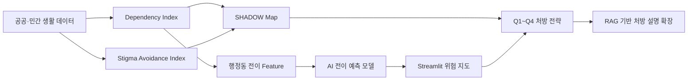

# 서울의 역설: SHADOW-AI

서울 5060 남성 1인가구의 고립 위험을 예측하고, SHADOW 유형별 처방을 제안하는 AI 의사결정 지원 시제품입니다.  
공공·민간 생활 데이터를 활용해 "편의 인프라가 많은 도시일수록 오히려 고립을 감출 수 있다"는 **편의의 역설**과, 복지 공급이 있어도 낙인·거부감 때문에 접근하지 않는 **복지의 역설**을 함께 봅니다.

## 핵심 아이디어

- **Dependency Index**: 배달, 통신, 생활편의 인프라 등 비대면 생활 의존도를 행정동 단위로 측정합니다.
- **Stigma Avoidance Index**: 복지 수요와 실제 복지 접근 사이의 괴리를 자치구 단위로 측정합니다.
- **SHADOW Map**: Dependency와 Avoidance를 2축으로 놓고 Q1~Q4 처방 유형을 나눕니다.
- **AI 전이 예측 모델**: 행정동별 편의 의존형 고립 위험 전이를 예측합니다.
- **Streamlit 대시보드**: 서울 전체 지도, 행정동 상세 분석, 자치구 비교, 모델 결과를 한 화면에서 확인합니다.
- **RAG 처방 모듈 예정**: SHADOW 유형, 행정동 리스크, 정책 문서를 연결해 근거 있는 처방 설명을 생성하는 구조로 확장합니다.



## 분석 단위

- SHADOW Map은 `자치구 단위`의 낙인 회피 맥락과 `행정동 단위`의 편의 의존 구조를 함께 해석합니다.
- AI 모델은 `행정동 단위`로 편의 의존형 고립 전이 위험을 예측합니다.
- 따라서 모델은 세밀한 위험 위치를 찾고, SHADOW Map은 정책 처방의 방향과 우선순위를 설명하는 역할을 합니다.

## 모델 성능 요약

| 예측 목표 | 모델 | AUC | Average Precision | 해석 |
|---|---:|---:|---:|---|
| label_slope | Logistic Regression | 0.768 | - | 유의미한 예측력 |
| label_slope | Gradient Boosting | 0.759 | - | 유의미한 예측력 |
| label_entry | Logistic Regression | 0.842 | 0.271 | 좋은 예측력 |
| label_entry | Gradient Boosting | 0.844 | 0.302 | 최종 권장 모델 |

현재 대시보드는 `Gradient Boosting` 기반 전이확률을 중심으로 보여줍니다. 예측값은 개인 단위가 아니라 행정동 단위의 지역 위험 신호로 해석해야 합니다.

## 저장소 구조

```text
.
├── dashboard.py                         # Streamlit 대시보드
├── code/                                # 지수 산출, 모델링, 시각화 코드
├── Data/
│   ├── seoul_dong.geojson               # 행정동 지도 경계
│   └── seoul_dong_code.csv              # 행정동 코드 매핑
├── Outputs/
│   ├── shadow_index.csv                 # SHADOW Map 산출 결과
│   ├── shadow_map.png                   # 자치구 SHADOW Map
│   ├── 편의의 역설/                     # Dependency Index 결과
│   ├── 복지의 역설/                     # Avoidance Index 결과
│   └── 전이예측/                        # AI 전이 예측 결과 및 모델
└── requirements.txt
```

## 실행 방법

```bash
pip install -r requirements.txt
python -m streamlit run dashboard.py
```

대시보드의 지도·상세 분석 화면은 저장소에 포함된 산출물을 기반으로 실행됩니다. `AI 분석 실행` 버튼으로 전체 파이프라인을 다시 돌리려면 원천 데이터가 필요하며, 로컬 Python 경로를 본인 환경에 맞게 조정해야 합니다.

## 주요 산출물

- `Outputs/shadow_map.png`: 서울 25개 자치구 SHADOW Map
- `Outputs/shadow_index.csv`: 자치구별 Dependency/Avoidance 결합 결과
- `Outputs/편의의 역설/dependency_index.csv`: 편의 의존도 지수
- `Outputs/복지의 역설/avoidance_index.csv`: 낙인 회피 지수
- `Outputs/전이예측/transition_predictions.csv`: 행정동별 전이확률
- `Outputs/전이예측/risk_predictions_final.csv`: 최종 위험 등급
- `Outputs/전이예측/model/`: 예측 모델과 메타데이터

## 데이터 공개 기준

원천 데이터와 개인/제출 문서는 저장소에 포함하지 않았습니다. 공개 저장소에는 코드, 재현 가능한 주요 산출물, 지도 경계 파일, 대시보드 실행에 필요한 최소 파일만 포함했습니다. 전체 재학습은 별도 원천 데이터 폴더가 있는 로컬 환경에서 수행하는 것을 전제로 합니다.

## 한계와 확장

- 일부 회피 지표는 자치구 단위라 행정동 단위 예측값과 해석 단위가 다릅니다.
- 모델은 2022~2025년 관측 데이터를 기반으로 한 지역 위험 예측이며 개인 위험 예측이 아닙니다.
- 향후 RAG 처방 모듈을 붙이면 Q1~Q4 처방의 정책 근거, 유사 사례, 행정동별 권고 문안을 함께 제시할 수 있습니다.
