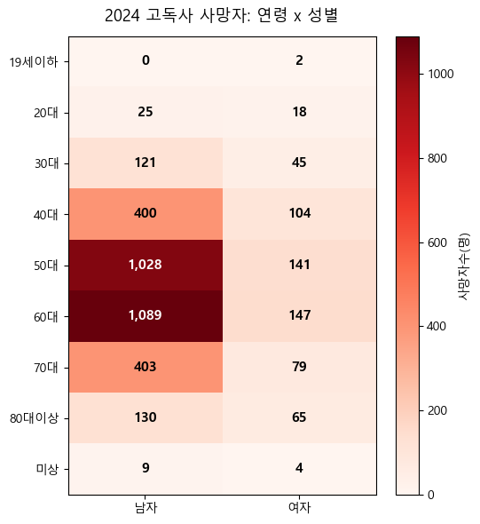
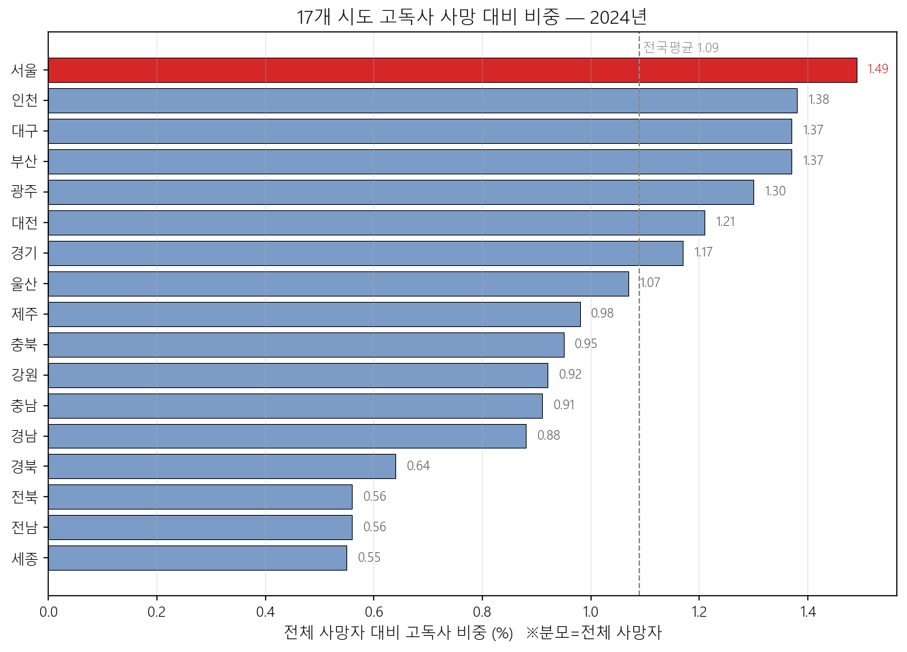
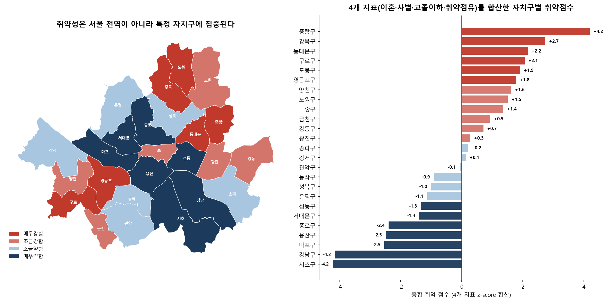
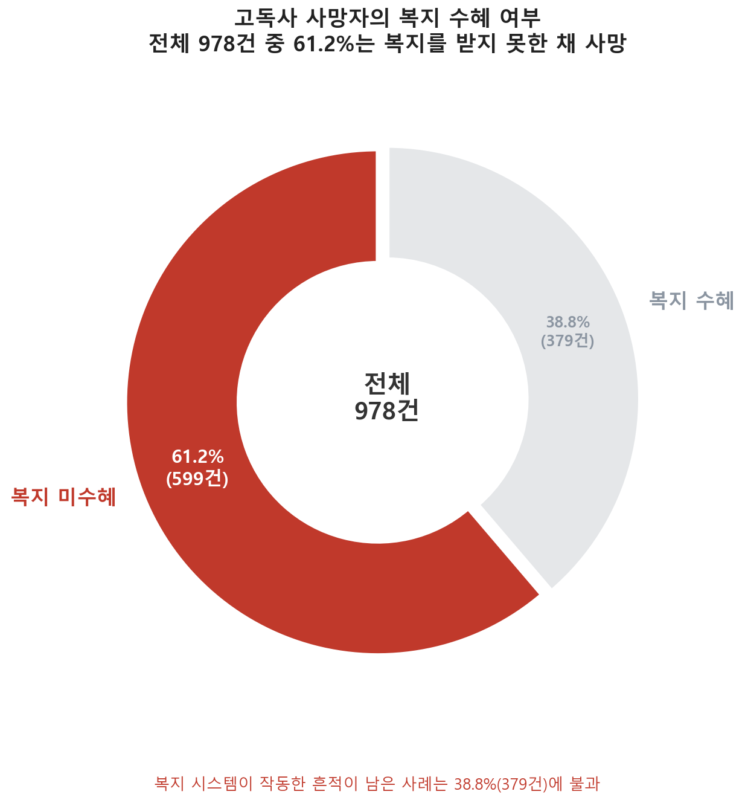
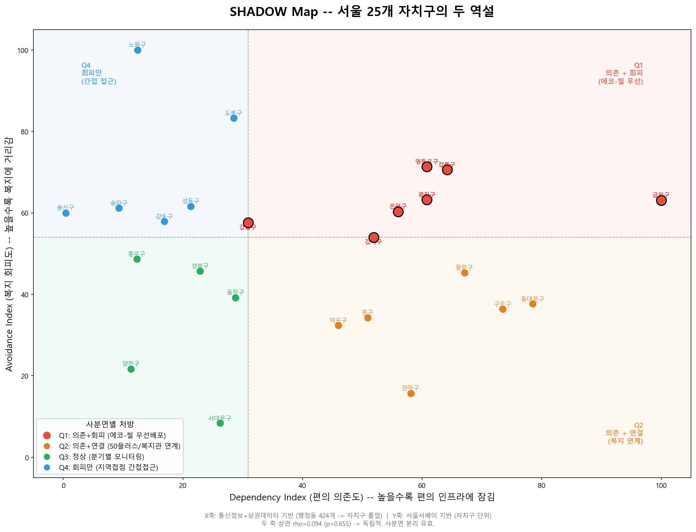
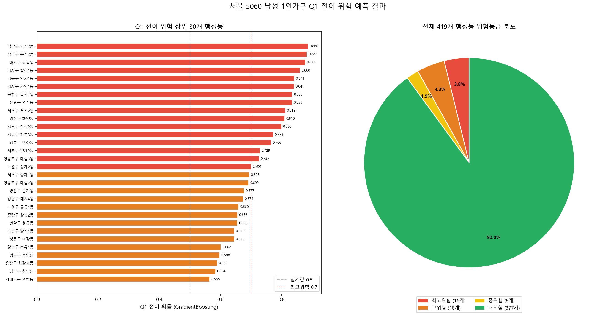

# 서울의 역설: SHADOW-AI

서울 5060 남성 1인가구의 보이지 않는 고립 위험을 찾고, 지역별로 다른 처방까지 제안하는 AI 기반 복지 의사결정 지원 프로젝트입니다.

핵심 질문은 하나입니다.

> 서울은 혼자 살기 가장 편하고, 위험자를 가장 잘 찾는 도시다. 그런데 왜 5060 남성은 그 안에서 가장 많이, 가장 보이지 않게 죽는가?

## 1. 문제정의

### 1단계: 고독사는 누구에게 집중되는가

2024년 전체 고독사 사망자의 54.0%는 50·60대 남성입니다. 복지 대상자였던 사망자 안에서도 5060 남성의 비중이 가장 높고, 발견 장소 역시 원룸·오피스텔·고시원처럼 1인 주거와 맞닿아 있습니다.



**확정 사실**: 고독사는 5060 남성에게 집중되며, 정의상 혼자 사는 사람의 죽음입니다.  
**남는 질문**: 그렇다면 이 죽음은 어느 지역에서 가장 두드러지는가?

### 2단계: 왜 서울인가

서울은 인구 10만 명당 고독사 발생률로는 전국 중상위권에 머물지만, 전체 사망자 대비 고독사 비중은 전국 1위입니다. 즉 서울은 단순히 인구가 많아서가 아니라, 서울에서 일어나는 죽음 중 고독사가 차지하는 몫이 유독 큽니다.



**확정 사실**: 서울은 전체 죽음에서 고독사가 차지하는 비중이 전국에서 가장 큽니다.  
**남는 질문**: 서울 안에서 5060 남성 1인가구는 어떤 생활 조건에 놓여 있는가?

### 3단계: 서울 5060 남성 1인가구는 경제·지역적으로 취약하다

서울 5060 남성 1인가구는 취업 상태에서도 단순노무 비중이 높아, 취업이 곧 안정으로 이어지지 않습니다. 이혼·사별, 고졸 이하, 취약 점유 등 비경제적 취약성도 동북·서남권 일부 자치구에 집중됩니다. 이 취약 등급은 생계급여 수급밀도와도 맞물려, 단순한 통계적 착시가 아님을 확인했습니다.



**확정 사실**: 서울 5060 남성 1인가구의 취약성은 특정 자치구에 집중됩니다.  
**남는 질문**: 가장 편리한 도시 서울의 생활 인프라는 이들의 고립을 완화하는가, 아니면 보이지 않게 유지시키는가?

### 4단계: 제도는 닿았는데, 왜 죽음은 막지 못했는가

서울은 고독사 위험자 발굴 규모가 크고 행정적 탐지 노력이 강한 도시입니다. 그러나 고독사 사망자 중 복지 대상자였거나, 복지 시스템이 한 번은 닿았던 사례도 존재합니다. 문제는 제도가 아예 없었던 것이 아니라, 닿았다고 보이는 지점에서도 죽음을 막지 못했다는 데 있습니다.



**확정 사실**: 서울은 위험자를 많이 찾지만, 발굴 실적이 곧 실제 고립 해소를 의미하지는 않습니다.  
**남는 질문**: 위험자를 가장 잘 찾는 도시에서, 정작 5060 남성에게는 무엇이 닿지 못했는가?

## 2. 서울의 역설

EDA의 종착점은 두 개의 충돌입니다.

- **편의의 역설**: 혼자 살아도 불편하지 않게 해주는 생활 인프라가 오히려 외출과 대면 접촉의 필요를 줄여 고립을 보이지 않게 유지할 수 있습니다.
- **복지의 역설**: 복지 인프라와 행정 발굴이 있어도, 낙인·거부감·남성 중장년의 회피 성향 때문에 실제 이용으로 이어지지 않을 수 있습니다.

그래서 이 프로젝트는 고립 위험을 하나의 점수로 합치지 않고, 두 축으로 분리해 봅니다.

## 3. SHADOW Map

SHADOW는 **Seoul Hidden Avoidance & Dependency Overlap Watch**의 약자입니다. 서울의 숨은 고립을 두 축으로 지도화합니다.

- **Dependency Index**: 편의 의존도. 배달·쇼핑·통신·외출·체류·생활편의 인프라를 바탕으로, 행정동이 비대면 생활 구조에 얼마나 잠겨 있는지 봅니다.
- **Stigma Avoidance Index**: 낙인 회피 지수. 복지 수요와 실제 복지 접근 사이의 괴리를 바탕으로, 복지를 회피하거나 제도와 연결되지 않는 정도를 봅니다.

두 축을 결합하면 자치구·행정동을 네 가지 처방 유형으로 나눌 수 있습니다.

| 유형 | 상태 | 처방 방향 |
|---|---|---|
| Q1 | 의존 높음 + 회피 높음 | 에코-씰, 우편 opt-out, 회신 불필요 방식처럼 낙인을 낮춘 비대면 개입 |
| Q2 | 의존 높음 + 회피 낮음 | 50플러스·복지관·생활 프로그램으로 직접 연계 |
| Q3 | 의존 낮음 + 회피 낮음 | 별도 자원 투입보다 분기별 모니터링 |
| Q4 | 의존 낮음 + 회피 높음 | 복지 언어보다 지역 상권·커뮤니티 기반의 간접 접근 |



## 4. SHADOW-AI

SHADOW-AI는 SHADOW Map을 정적인 설명 도구로 끝내지 않고, 행정동 단위의 위험 전이를 예측하는 모델로 확장합니다.

예측 목표는 “지금 당장 위험한 곳”만 찾는 것이 아니라, **편의 의존형 고립 위험으로 진입할 가능성이 큰 행정동**을 선제적으로 찾는 것입니다.

| 예측 목표 | 모델 | AUC | Average Precision |
|---|---:|---:|---:|
| label_slope | Logistic Regression | 0.768 | 0.606 |
| label_slope | Gradient Boosting | 0.759 | 0.628 |
| label_entry | Logistic Regression | 0.842 | 0.271 |
| label_entry | Gradient Boosting | 0.844 | 0.302 |

최종 대시보드는 Gradient Boosting 기반 전이확률을 중심으로 행정동별 위험도를 보여줍니다. 예측값은 개인 단위 예측이 아니라 지역 단위 위험 신호입니다.



## 5. Streamlit 시제품

Streamlit 대시보드는 다음 흐름을 보여줍니다.

- 서울 전체 행정동 위험 지도
- 행정동별 전이확률과 위험 등급
- 자치구별 SHADOW 맥락 비교
- SHAP 기반 주요 위험 요인 확인
- 향후 RAG 처방 모듈로 확장 가능한 구조

```bash
pip install -r requirements.txt
python -m streamlit run dashboard.py
```

## 6. 저장소 구조

```text
.
├── dashboard.py
├── code/
│   ├── build_dependency_index.py
│   ├── build_avoidance_index.py
│   ├── build_transition_features.py
│   ├── train_transition_model.py
│   └── predict_risk.py
├── Data/
│   ├── seoul_dong.geojson
│   └── seoul_dong_code.csv
└── Outputs/
    ├── EDA/
    ├── shadow_map.png
    ├── shadow_index.csv
    ├── 편의의 역설/
    ├── 복지의 역설/
    └── 전이예측/
```

## 7. 데이터 공개 기준

원천 데이터와 개인 제출 문서는 저장소에 포함하지 않았습니다. 공개 저장소에는 코드, 주요 산출물, 지도 경계 파일, 대시보드 실행에 필요한 최소 파일만 포함했습니다. 전체 재학습은 별도 원천 데이터가 있는 로컬 환경에서 수행하는 것을 전제로 합니다.

## 8. 다음 확장: RAG 처방 설명

향후 RAG 모듈은 Q1~Q4 처방 설계서, 복지 정책 문서, 행정동별 예측 결과를 연결해 “왜 이 지역에 이 처방이 필요한지”를 근거 문장으로 설명하는 역할을 맡습니다.

즉 SHADOW-AI의 최종 형태는 단순 예측 모델이 아니라, **어디가 위험한지, 왜 위험한지, 어떤 방식으로 접근해야 하는지**까지 제안하는 처방형 AI입니다.
